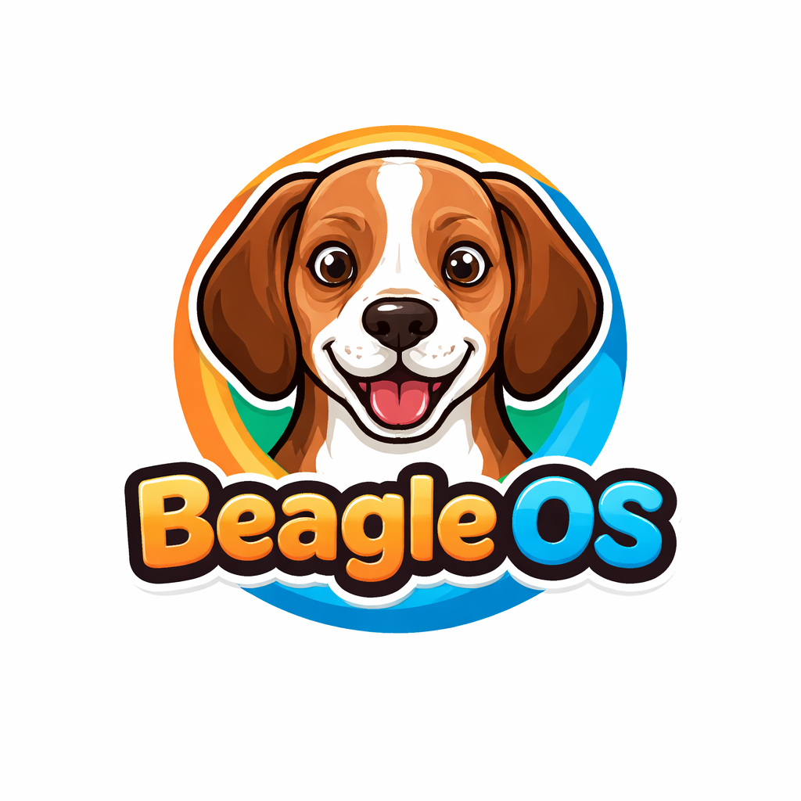
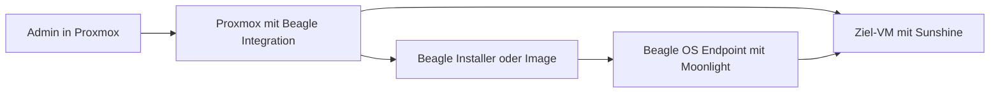

  

# Beagle OS

Beagle OS is a Proxmox-native endpoint OS and management stack for streaming virtual desktops.

Das Konzept ist absichtlich eng geführt:

- Proxmox ist die zentrale Management- und Betriebsplattform
- die VM liefert den Stream mit Sunshine
- der Client verbindet sich mit Moonlight
- Beagle OS ist das dedizierte Endpoint-OS für diesen Zweck
- das Projekt positioniert sich als offene, Proxmox-zentrierte Endpunktplattform

Beagle OS ist kein Sammelsurium für verschiedene Remote-Protokolle. Der Produktpfad ist genau einer:

- `Sunshine` in der Ziel-VM
- `Moonlight` auf Beagle OS
- `Proxmox` als Inventar-, Bereitstellungs- und Betriebsoberfläche

## Produktidee

Beagle OS besteht aus zwei zusammengehörigen Ebenen:

1. `Beagle Control Plane auf Proxmox`
2. `Beagle OS als Thin-Client-Betriebssystem`

Die Control Plane hängt direkt an Proxmox und macht VMs zu verwaltbaren Streaming-Zielen.
Das Betriebssystem bootet auf Thin Clients, Mini-PCs oder USB-Medien und startet danach direkt Moonlight gegen die zugewiesene VM.

Im Ergebnis entsteht kein klassischer "Remote-Desktop-Baukasten", sondern eine gemanagte Endpunktlösung:

- VM-bezogene Installer direkt aus Proxmox
- aufgeloeste VM-Profile direkt in der Proxmox-Oberflaeche
- vorkonfigurierte Streaming-Ziele pro VM
- reproduzierbare Client-Images
- dedizierte Thin-Client-Endpunkte statt allgemeiner Linux-Desktops
- Betriebsmodell für viele Clients mit gleichem Zielbild
- Geräte-Diagnostik und Support-Bundles direkt im Endpoint-OS
- vorbereitbare Moonlight-Client-Identitäten für reproduzierbare Sunshine-Freischaltung

## Zielbild

Beagle OS ist als offene Endpunkt- und Managementplattform fuer virtuelle Arbeitsplaetze gedacht:

- nicht Citrix- oder VMware-zentriert
- nicht auf generische Broker-Stacks angewiesen
- stattdessen direkt an Proxmox gekoppelt
- optimiert für Moonlight/Sunshine-Streaming
- gebaut für feste, kontrollierte Endgeräte

Kurz gesagt:

- `offenes Management-Modell fuer Endpunkte`
- `Proxmox-native Orchestrierung`
- `Moonlight/Sunshine als einziger Streaming-Stack`

## Betriebsmodell

Der operative Ablauf ist bewusst einfach:

1. Beagle-Integration auf dem Proxmox-Host installieren.
2. Eine VM als Sunshine-Stream-Ziel vorbereiten.
3. Die Zielparameter in Proxmox an die VM binden.
4. Einen Beagle-OS-Installer oder ein Beagle-OS-Image ausrollen.
5. Den Client booten und direkt gegen die zugeordnete VM streamen.

Damit wird Proxmox nicht nur Compute-Plattform, sondern zugleich:

- Inventar fuer Streaming-VMs
- Ausgabepunkt fuer Client-Installer
- Quelle fuer VM-spezifische Presets
- zentraler Integrationspunkt fuer Beagle OS

## Hauptkomponenten

### 1. Beagle Control Plane auf Proxmox

Die Host-Seite liefert die Management-Funktionen:

- Integration in die Proxmox-Oberflaeche
- Beagle-Profil-Dialoge mit Export-, Download- und Health-Aktionen pro VM
- VM-spezifische Artefakt-Erzeugung
- Download-Endpunkte fuer Installer und Images
- lokale Control-Plane-API fuer Health und Inventar
- Reapply-/Refresh-Mechanismen nach Host-Aenderungen

Wichtig ist dabei die Produktlogik:

- eine VM wird als Sunshine-Ziel beschrieben
- Beagle erzeugt daraus den passenden Client-Preset
- der Client startet anschliessend Moonlight gegen genau dieses Ziel

### 2. Beagle OS als Endpoint-Betriebssystem

Beagle OS ist das eigentliche Thin-Client-OS.
Es ist kein allgemeines Desktop-System, sondern auf den Streaming-Zweck reduziert.

Kernpunkte:

- eigener Build-Pfad fuer das OS
- eigener Kernel-Paketpfad (`-beagle`)
- bootfaehige Images fuer Test, Rollout und VM-Betrieb
- Runtime fuer Netzwerk, Autostart und Moonlight-Sessionstart

### 3. VM-gebundene Bereitstellung

Die Bereitstellung ist VM-zentriert statt benutzerzentriert.
Eine konkrete VM in Proxmox ist das Streaming-Ziel.
Daraus entstehen:

- ein VM-spezifischer USB-Installer
- ein gebuendeltes Preset mit Host, App und Pairing-Daten
- ein reproduzierbarer Endpunkt, der nach Installation direkt die richtige VM startet

## Warum nur Moonlight und Sunshine

Diese Festlegung ist kein Marketing-Satz, sondern ein Architekturentscheid.

Mehrere Protokolle klingen flexibel, machen das Produkt aber weicher, schwerer testbar und operativ unsauber.
Beagle OS verfolgt stattdessen einen klaren Standardpfad:

- ein Streaming-Protokoll
- ein Client
- ein Server
- ein Provisionierungsmodell

Das bringt klare Vorteile:

- weniger Betriebsvarianten
- weniger UI- und Installer-Komplexitaet
- besser reproduzierbare Tests
- besser optimierbare Latenz
- einfachere Fehleranalyse
- konsistentere Benutzererfahrung

## Architektur in einem Satz

Beagle OS macht aus Proxmox eine Verwaltungsoberflaeche fuer Moonlight/Sunshine-Endpunkte und liefert dazu ein dediziertes Endpoint-OS aus.

## Typischer Ablauf

## Repository-Fokus

Dieses Repository baut die benoetigten Bausteine:

- Proxmox-Integration
- Host-seitige Artefakt-Erzeugung
- Thin-Client-Runtime
- USB- und Installationspfad
- Beagle-OS-Image-Build
- Sunshine-Gastkonfiguration fuer Ziel-VMs

## Wichtige Einstiege

- Host-Installation: [`scripts/install-proxmox-host.sh`](./scripts/install-proxmox-host.sh)
- Host-Gesundheit pruefen: [`scripts/check-proxmox-host.sh`](./scripts/check-proxmox-host.sh)
- Sunshine-Gast vorbereiten: [`scripts/configure-sunshine-guest.sh`](./scripts/configure-sunshine-guest.sh)
- Moonlight-Client auf Sunshine vorregistrieren: [`scripts/register-moonlight-client-on-sunshine.sh`](./scripts/register-moonlight-client-on-sunshine.sh)
- Beagle-OS-Image bauen: [`scripts/build-beagle-os.sh`](./scripts/build-beagle-os.sh)
- Build-Doku: [`docs/beagle-os-build.md`](./docs/beagle-os-build.md)
- Thin-Client-Komponenten: [`thin-client-assistant/`](./thin-client-assistant/)

## Aktuelle Produktausrichtung

Die Zielrichtung fuer dieses Repository ist eindeutig:

- Beagle OS wird als eigenes Endpoint-OS aufgebaut
- Beagle integriert sich direkt in Proxmox
- Beagle verwendet ausschliesslich Moonlight auf Client-Seite
- die gestreamten VMs verwenden Sunshine
- der Proxmox-Host uebernimmt die Management- und Bereitstellungsrolle

Alles andere ist fuer das Produkt zweitrangig.
