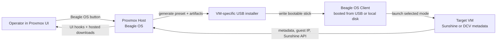
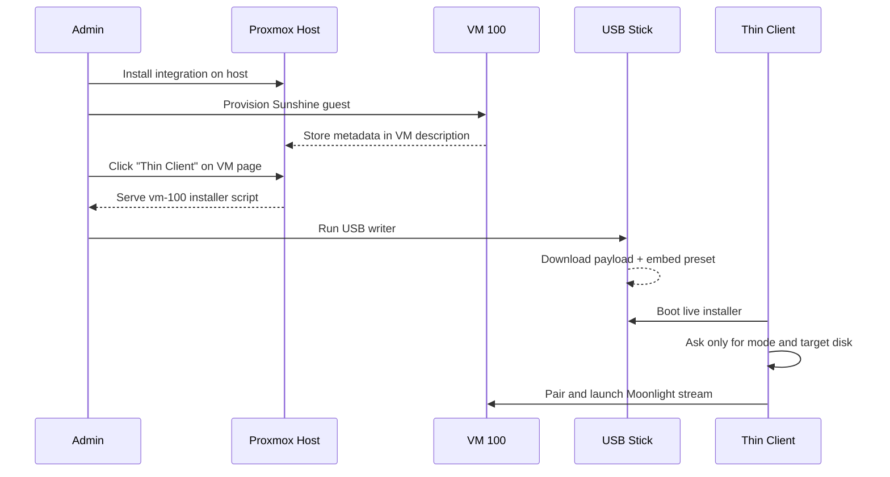
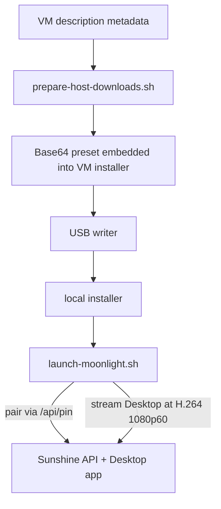

# Beagle OS

Beagle OS is a thin-client focused operating system project with two deployable tracks:

- an own OS image build with custom kernel (`-beagle`)
- a Proxmox integration layer for VM-aware thin-client delivery (`MOONLIGHT`, `SPICE`, `noVNC`, `DCV`)

Typical deployment path:

- install Beagle integration on the Proxmox host
- provision a Sunshine target VM
- create/use a Beagle OS client image
- start low-latency Moonlight streaming to the target VM

## Quick Links

- Latest release: [GitHub Releases](https://github.com/meinzeug/beagle-os/releases/latest)
- Host install: [`scripts/install-proxmox-host.sh`](./scripts/install-proxmox-host.sh)
- Sunshine guest provisioning: [`scripts/configure-sunshine-guest.sh`](./scripts/configure-sunshine-guest.sh)
- Proxmox VM baseline for Beagle OS: [`scripts/optimize-proxmox-vm-for-beagle.sh`](./scripts/optimize-proxmox-vm-for-beagle.sh)
- Build Beagle OS image (own kernel): [`scripts/build-beagle-os.sh`](./scripts/build-beagle-os.sh)
- Build docs: [`docs/beagle-os-build.md`](./docs/beagle-os-build.md)
- Thin-client docs: [`docs/thin-client-installation.md`](./docs/thin-client-installation.md)
- Architecture docs: [`docs/architecture.md`](./docs/architecture.md)

## What It Does

Beagle OS adds three deployable layers around Proxmox VE:

| Layer | Purpose | Result |
| --- | --- | --- |
| Proxmox UI integration | Adds one simple VM action directly in Proxmox | `Beagle OS` |
| Host-side artifact publishing | Builds and serves VM-aware installers | `https://<host>:8443/pve-dcv-downloads/...` |
| Thin-client runtime | Turns a device into a dedicated session endpoint | `MOONLIGHT`, `SPICE`, `NOVNC`, `DCV` |

It stays independent from Proxmox core:

- no fork of Proxmox packages
- no permanent patch set inside upstream packages
- reinstall/reapply logic survives `pve-manager` updates

## Recommended 2026 Deployment

For a CPU-only Proxmox host, the preferred low-latency path is:

- Sunshine inside the guest VM
- Moonlight on the thin client
- `H.264`
- `1080p60`
- wired Ethernet
- lightweight guest desktop with Xfce + LightDM
- compositor disabled

That is exactly what `scripts/configure-sunshine-guest.sh` now prepares.

## System Overview



## End-to-End Flow



## Main Components

### 1. Proxmox UI Integration

The project can work in two UI modes:

- browser extension from [`extension/`](./extension/)
- host-installed UI integration from [`proxmox-ui/`](./proxmox-ui/)

Operator-facing action:

- `Thin Client`

The Proxmox UI is intentionally reduced to one per-VM entry point. That action downloads the preconfigured USB installer for the selected VM and hides the lower-level helper links from day-to-day operators.

### 2. Host-Side Downloads

The Proxmox host publishes locally generated artifacts under:

```text
https://<proxmox-host>:8443/pve-dcv-downloads/
```

Key outputs:

- `pve-thin-client-usb-installer-vm-<vmid>.sh`
- `pve-thin-client-usb-installer-host-latest.sh`
- `pve-thin-client-usb-payload-latest.tar.gz`
- `pve-dcv-downloads-status.json`
- `SHA256SUMS`

VM-specific installer scripts are generated from Proxmox VM config and description metadata.

### 3. Thin-Client Runtime

The runtime lives in [`thin-client-assistant/`](./thin-client-assistant/) and supports:

| Mode | Runtime | Typical use |
| --- | --- | --- |
| `MOONLIGHT` | Sunshine + Moonlight | preferred low-latency desktop path |
| `SPICE` | `remote-viewer` | Proxmox console workflow |
| `NOVNC` | Chromium kiosk | browser-only fallback |
| `DCV` | `dcvviewer` / browser proxy | DCV environments |

## Sunshine / Moonlight Path



Current Sunshine defaults:

- `encoder = software`
- `sw_preset = superfast`
- `sw_tune = zerolatency`
- `hevc_mode = 0`
- `av1_mode = 0`
- Xfce + LightDM
- compositor disabled

## Quick Start

### Install On A Proxmox Host

From the latest release:

```bash
tmpdir="$(mktemp -d)"
cd "$tmpdir"
curl -fsSLo pve-dcv.tar.gz \
  https://github.com/meinzeug/beagle-os/releases/latest/download/pve-dcv-thin-client-assistant-latest.tar.gz
tar -xzf pve-dcv.tar.gz
./scripts/install-proxmox-host.sh
```

What this does:

1. installs the project into `/opt/pve-dcv-integration`
2. installs or reapplies the Proxmox UI hooks
3. installs host refresh and reapply services
4. publishes USB artifacts on `:8443`
5. keeps the integration resilient across later Proxmox updates

### Provision A Sunshine Guest

```bash
./scripts/configure-sunshine-guest.sh \
  --proxmox-host thinovernet \
  --vmid 100 \
  --guest-user dennis \
  --sunshine-user sunshine \
  --sunshine-password 'choose-a-strong-password'
```

This helper:

- installs Xfce and LightDM
- switches autologin to the target user
- configures Sunshine for software H.264 streaming
- writes a desktop autostart entry
- disables Xfce compositor overhead
- updates the VM description with Moonlight/Sunshine metadata

### Build A VM-Specific USB Installer

From the Proxmox UI, use the `Thin Client` action on the target VM.

Or call the hosted URL directly:

```text
https://<proxmox-host>:8443/pve-dcv-downloads/pve-thin-client-usb-installer-vm-<vmid>.sh
```

### Write The USB Stick

```bash
./pve-thin-client-usb-installer-vm-100.sh
```

The standalone writer:

- downloads the payload from the same Proxmox host
- verifies `SHA256SUMS` when present
- writes a BIOS+UEFI bootable USB medium
- stores the VM preset on the medium

### Boot The Thin Client

On preseeded media, the local installer only needs:

1. the streaming mode
2. the target disk

All per-VM connection data can already be baked in.

### Build Beagle OS Image (Own Kernel)

```bash
./scripts/build-beagle-os.sh \
  --kernel-version 6.12.22 \
  --kernel-localversion -beagle \
  --hostname beagle-os
```

Full details:

- [`docs/beagle-os-build.md`](./docs/beagle-os-build.md)

## VM Metadata Model

The integration consumes VM description metadata to build URLs and presets.

Example:

```text
sunshine-host: 10.10.10.100
sunshine-api-url: https://10.10.10.100:47990
sunshine-user: sunshine
sunshine-password: <secret>
sunshine-pin: 0100
sunshine-app: Desktop
moonlight-host: 10.10.10.100
moonlight-app: Desktop
moonlight-resolution: 1080
moonlight-fps: 60
moonlight-bitrate: 20000
moonlight-video-codec: H.264
thinclient-default-mode: MOONLIGHT
```

The same metadata model also still supports:

- `dcv-url`
- `dcv-host`
- `dcv-user`
- `dcv-password`
- `spice-url`
- `novnc-url`

## Repository Layout

| Path | Purpose |
| --- | --- |
| [`extension/`](./extension/) | browser extension |
| [`proxmox-ui/`](./proxmox-ui/) | host-side Proxmox UI asset |
| [`proxmox-host/`](./proxmox-host/) | host-side service templates |
| [`thin-client-assistant/`](./thin-client-assistant/) | runtime, installer, USB tooling |
| [`scripts/`](./scripts/) | install, packaging, validation, guest provisioning |
| [`docs/`](./docs/) | deeper architecture and installation docs |

## Release Artifacts

`./scripts/package.sh` produces:

| Artifact | Purpose |
| --- | --- |
| `pve-dcv-integration-extension-v<version>.zip` | browser extension bundle |
| `pve-dcv-thin-client-assistant-v<version>.tar.gz` | installable project bundle |
| `pve-dcv-thin-client-assistant-latest.tar.gz` | host install entrypoint |
| `pve-thin-client-usb-installer-v<version>.sh` | generic USB writer |
| `pve-thin-client-usb-installer-latest.sh` | latest generic USB writer |
| `pve-thin-client-usb-payload-v<version>.tar.gz` | live installer payload |
| `pve-thin-client-usb-payload-latest.tar.gz` | latest live installer payload |
| `dist/beagle-os/*.qcow2` | own Beagle OS VM image (built via `build-beagle-os.sh`) |
| `dist/beagle-os/*.raw` | own Beagle OS raw disk image |
| `SHA256SUMS` | release verification |

## Operations

### Validate The Checkout

```bash
./scripts/validate-project.sh
```

### Publish GitHub Release

```bash
./scripts/create-github-release.sh
```

### Refresh Hosted Artifacts On The Host

```bash
sudo /opt/pve-dcv-integration/scripts/refresh-host-artifacts.sh
```

### Check Host Health

```bash
sudo /opt/pve-dcv-integration/scripts/check-proxmox-host.sh
```

### Inspect Published Host Status

```text
https://<proxmox-host>:8443/pve-dcv-downloads/pve-dcv-downloads-status.json
```

## Update Resilience

The host installation is designed to survive normal Proxmox updates:

- UI assets are re-applied automatically
- hosted downloads are refreshed by service/timer
- the project remains isolated under `/opt/pve-dcv-integration`
- release-tarball installs can reuse published USB payloads instead of rebuilding locally

## Related Docs

- [Architecture](./docs/architecture.md)
- [Thin-client installation](./docs/thin-client-installation.md)
- [Changelog](./CHANGELOG.md)
- [License](./LICENSE)
